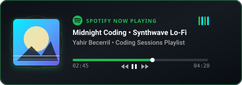

<!-- ========================================== -->
<!-- 🚀 CABECERA ANIMADA CON ONDAS Y GRADIENTE -->
<!-- ========================================== -->
<p align="center">

</p>

<!-- ========================================== -->
<!-- ⌨️ MÁQUINA DE ESCRIBIR DINÁMICA (TYPING SVG) -->
<!-- ========================================== -->
<p align="center">
<a href="https://github.com/YahirBecerrilG">

</a>
</p>

<!-- ========================================== -->
<!-- 📌 BADGES DE ESTADO Y CONTADOR DE VISTAS -->
<!-- ========================================== -->
<p align="center">

&nbsp;

&nbsp;

</p>

<br>

---

<!-- ========================================== -->
<!-- 🎧 TARJETA SPOTIFY COMPLETA Y ANIMADA -->
<!-- ========================================== -->
### 🎧 `Now Playing on Spotify` • Soundtrack de Código

<p align="center">
<i>Tarjeta interactiva con portada del álbum, disco de vinilo giratorio, ecualizador en vivo y barra de reproducción:</i>
</p>

<p align="center">
<a href="https://open.spotify.com/playlist/37i9dQZF1DXdLEN7aqioXM" target="_blank">

</a>
</p>

<p align="center">
<a href="https://open.spotify.com/playlist/37i9dQZF1DXdLEN7aqioXM" target="_blank">

</a>
</p>

<br>

---

<!-- ========================================== -->
<!-- ⚡ TERMINAL VIRTUAL DEL DESARROLLADOR -->
<!-- ========================================== -->
### ⚡ `whoami.sh` • Perfil del Desarrollador

```bash
yahir@developer-station:~$ cat profile.json
{
  "desarrollador": "Yahir Becerril",
  "especialidad": "Software Developer & Creator",
  "intereses": ["Desarrollo Web Fullstack", "Arquitectura Backend", "Automatización", "UI/UX Dinámico"],
  "filosofia": "Convertir café y buena música en soluciones reales de alto impacto ☕✨",
  "estado": "🚀 Construyendo proyectos innovadores"
}
```

<br>

---

<!-- ========================================== -->
<!-- 🛠️ ARSENAL TECNOLÓGICO CON SKILLICONS -->
<!-- ========================================== -->
### 🛠️ Arsenal Tecnológico & Herramientas

<p align="center">
<i>Librerías, frameworks, lenguajes y herramientas que utilizo en mis desarrollos:</i>
</p>

<p align="center">
<a href="https://skillicons.dev">

</a>
</p>

<br>

---

<!-- ========================================== -->
<!-- 📈 GRÁFICA DE ACTIVIDAD & RITMO DE CÓDIGO -->
<!-- ========================================== -->
### 📈 Gráfica de Actividad & Ritmo de Commits

<p align="center">
<a href="https://github.com/YahirBecerrilG">

</a>
</p>

<br>

---

<!-- ========================================== -->
<!-- 📊 ESTADÍSTICAS & MÉTRICAS DE GITHUB -->
<!-- ========================================== -->
### 📊 Estadísticas & Métricas de GitHub

<p align="center">

&nbsp;

</p>

<p align="center">

</p>

<br>

---

<!-- ========================================== -->
<!-- 💬 CITA DINÁMICA DE PROGRAMACIÓN -->
<!-- ========================================== -->
<p align="center">

</p>

<br>

---

<!-- ========================================== -->
<!-- 📬 REDES SOCIALES Y CONTACTO -->
<!-- ========================================== -->
### 📬 ¡Conectemos y creemos algo increíble!

<p align="center">
<a href="https://www.instagram.com/yahiirbg/" target="_blank">

</a>
&nbsp;
<a href="mailto:becerrilyahir77@gmail.com">

</a>
&nbsp;
<a href="https://github.com/YahirBecerrilG" target="_blank">

</a>
&nbsp;
<a href="https://open.spotify.com" target="_blank">

</a>
</p>

<br>

<!-- ========================================== -->
<!-- 🌊 FOOTER CON ONDA INVERTIDA Y CRÉDITOS -->
<!-- ========================================== -->
<p align="center">

</p>

<p align="center">
<b>⚡ <i>"El código bien hecho se siente como una buena canción: fluye con naturalidad."</i> ⚡</b><br>
<sub>✨ Creado con pasión, ritmo y código por <b>Yahir Becerril</b> ✨</sub>
</p>